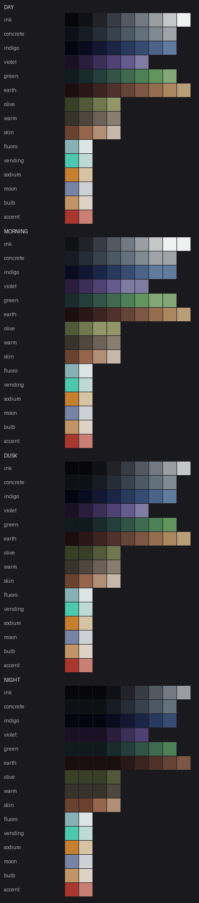

# 磐戸町奇譚 72色パレット

`iwato.gpl` — GIMP / Aseprite 形式。`project.yaml` の `palette.file` から参照する。

```bash
python tools/build_palette.py --project iwato   # 再生成と検証
```

**このパレットは手で色を並べたものではない。**
[`palette_spec.yaml`](palette_spec.yaml) に系統ごとの「ランプ（明度段の列）」を
定義し、そこから生成している。**時間帯差分をパレット置換で作る方針のため、
置換が段のシフトとして成立する構造でなければならない**からである。
色を1つ変えたいときは `.gpl` ではなく spec を編集して再生成すること。



上から 昼 / 朝 / 夕 / 夜。**光源色（下6行）は時間帯で変化しない。**

---

## 構成

| 系統 | 色数 | 役割 |
| --- | ---: | --- |
| `ink` 墨・無彩色 | 9 | 明度の基準軸。夜の最暗部から白線・蛍光灯の反射まで |
| `concrete` コンクリート・アスファルト | 8 | **本作で最も面積を占める。** 青みを帯びた灰 |
| `indigo` 藍 | 8 | 夜と暗所の主役 |
| `violet` 青紫 | 6 | 月夜の環境光、空気遠近 |
| `green` 褪せた緑 | 8 | 夏枯れの草・杉・苔。**青緑側に寄っている** |
| `olive` 枯れた草 | 4 | **8月の乾いた草。緑と土のあいだの色相の穴を埋める** |
| `earth` 土・錆・木 | 9 | 地面・トタン・木部・瓦。**赤味が強い** |
| `warm` 暖かい中性 | 4 | **踏み固められた土・埃。中性の灰は青いため別に持つ** |
| `skin` 肌 | 4 | UI とアイコン用 |
| **光源色** | **12** | **ここだけ彩度を持つことが許される** |
| **合計** | **72** | |

**地の色は60色すべてが褪せている。** 彩度を持つのは光源12色だけである。
自販機・蛍光灯・街灯・月・電球・アクセント赤の6種を各2段。

### ★ 規約 — 増やしてよいのは段数であって、鮮やかさではない

64色から72色へ広げた（2026-09-04）。**したがって「色数を増やしてよい」
という規約ではない。** 歯止めは色数ではなく**彩度**に置く。

1. **地の色は彩度 0.40 以下。例外を設けない。**
2. **鮮やかさが許されるのは光源色だけ。**
3. **光源色は12色を上限とする。** 増やすには個別の承認を要する。
4. **色を足すときは、欠落の実測を根拠として `palette_spec.yaml` に残す。**

`color_image` によるパレット強制が機能したのは
（[PILOT_FINDINGS 第4節](../../../docs/PILOT_FINDINGS.md)）、
出せる色が**褪せているから**であって、64個だったからではない。

**olive / warm を足した根拠**（実測）:

```
色相 45〜100度（オリーブ・黄緑）         … 0色 / 64色
色相 20〜50度 かつ 彩度0.16未満（暖かい灰） … 0色 / 64色
```

緑（H104〜171）と土（H356〜36）のあいだに色相の穴が空いており、
混ぜるほど両者が対立して**迷彩柄**になっていた。12案を試して全滅した。
**パラメータの調整では解けない構造的な欠落だった。**

---

## 使い方の原則

1. **彩度の高い色は光源にのみ。** `fluoro` `vending` `sodium` `moon` `bulb` `accent`
   以外を高彩度で使わない。地の色は必ず褪せた52色から取る。
2. **1つの素材は1つの系統のランプ内で完結させる。**
   系統をまたいで陰影を作らない。またぐと時間帯置換が破綻する。
3. **暗部は無彩色ではなく色を持たせる。** 墨は `ink[1]` ではなく
   `indigo[1]` や `concrete[1]` を使う。実測で「影が色を持つ」ことを
   確認している（[PALETTE_ANALYSIS.md](PALETTE_ANALYSIS.md)）。
4. **`accent` は極小面積にのみ。** 自販機のボタン、のぼり、非常灯。
   面で使うと画面が壊れる。

---

## 時間帯置換

`time_variants` に定義済み。**色を直接指定せず「系統と段のシフト」で表す**ため、
置換先が必ずパレット内に存在する。

| 系統 | 昼（基準） | 朝 | 夕 | 夜 |
| --- | --- | --- | --- | --- |
| `ink` 墨・無彩色 | 9段 `#070709`→`#EFF0F0` | +1 | -1 | -2 |
| `concrete` コンクリート | 8段 `#0D1116`→`#9FA4A8` | +1 | -1 | -2 |
| `indigo` 藍 | 8段 `#040510`→`#617B9E` | +1 | ±0 | -2 |
| `violet` 青紫 | 6段 `#1B1127`→`#807BA3` | +1 | ±0 | -2 |
| `green` 褪せた緑 | 8段 `#101A1E`→`#83A776` | +1 | -1 | -2 |
| `earth` 土・錆・木 | 9段 `#1B0E0F`→`#B89F7A` | ±0 | ±0 | **-3** |
| `skin` 肌 | 4段 `#6A412F`→`#C7B7A8` | ±0 | ±0 | -1 |

`earth` だけ夜のシフトが1段大きいのは、**暖色が同じ明度でも知覚的に明るく
見えるため**である。-2 のままだと夜景で土だけが浮く（スウォッチで確認済み）。

**検証結果**（`build_palette.py` が毎回検査する）:

| 時間帯 | 地の色52色のうち識別できる色数 | 潰れ |
| --- | ---: | ---: |
| 昼 | 52 | 0 |
| 朝 | 47 | 5 |
| 夕 | 49 | 3 |
| 夜 | **38** | **14** |

夜の潰れ14は**各ランプの最暗2段が端で丸められるため**であり、設計どおりである。
深い闇で全てが黒へ収束するのは物理的に正しい。**38色残れば夜景で素材の
区別はつく**（草・土・道路・コンクリートがそれぞれ別の色を保つ）。

---

## スウォッチ表

#### `ink` — 墨・無彩色

| 段 | HEX | RGB | H | S | L |
| ---: | --- | --- | ---: | ---: | ---: |
| 1 | `#070709` | 7, 7, 9 | 224 | 0.14 | 3 |
| 2 | `#101114` | 16, 17, 20 | 222 | 0.12 | 7 |
| 3 | `#212329` | 33, 35, 41 | 220 | 0.11 | 14 |
| 4 | `#373B43` | 55, 59, 67 | 218 | 0.10 | 24 |
| 5 | `#535861` | 83, 88, 97 | 216 | 0.08 | 35 |
| 6 | `#727982` | 114, 121, 130 | 214 | 0.07 | 48 |
| 7 | `#9A9EA3` | 154, 158, 163 | 212 | 0.05 | 62 |
| 8 | `#C4C6C8` | 196, 198, 200 | 210 | 0.04 | 77 |
| 9 | `#EFF0F0` | 239, 240, 240 | 208 | 0.02 | 94 |

#### `concrete` — コンクリート・アスファルト

| 段 | HEX | RGB | H | S | L |
| ---: | --- | --- | ---: | ---: | ---: |
| 1 | `#0D1116` | 13, 17, 22 | 216 | 0.26 | 7 |
| 2 | `#171C24` | 23, 28, 36 | 214 | 0.23 | 12 |
| 3 | `#252E38` | 37, 46, 56 | 213 | 0.20 | 18 |
| 4 | `#37424D` | 55, 66, 77 | 211 | 0.17 | 26 |
| 5 | `#4C5864` | 76, 88, 100 | 209 | 0.14 | 35 |
| 6 | `#63717C` | 99, 113, 124 | 207 | 0.11 | 44 |
| 7 | `#7F8A92` | 127, 138, 146 | 206 | 0.08 | 54 |
| 8 | `#9FA4A8` | 159, 164, 168 | 204 | 0.05 | 64 |

#### `indigo` — 藍（寒色の影）

| 段 | HEX | RGB | H | S | L |
| ---: | --- | --- | ---: | ---: | ---: |
| 1 | `#040510` | 4, 5, 16 | 234 | 0.60 | 4 |
| 2 | `#090C1E` | 9, 12, 30 | 231 | 0.55 | 8 |
| 3 | `#111732` | 17, 23, 50 | 228 | 0.50 | 13 |
| 4 | `#1B2647` | 27, 38, 71 | 225 | 0.45 | 19 |
| 5 | `#29385D` | 41, 56, 93 | 223 | 0.39 | 26 |
| 6 | `#384C73` | 56, 76, 115 | 220 | 0.34 | 34 |
| 7 | `#4B6389` | 75, 99, 137 | 217 | 0.29 | 42 |
| 8 | `#617B9E` | 97, 123, 158 | 214 | 0.24 | 50 |

#### `violet` — 青紫（月光・遠景）

| 段 | HEX | RGB | H | S | L |
| ---: | --- | --- | ---: | ---: | ---: |
| 1 | `#1B1127` | 27, 17, 39 | 268 | 0.40 | 11 |
| 2 | `#2A1D3D` | 42, 29, 61 | 264 | 0.36 | 18 |
| 3 | `#3B2E57` | 59, 46, 87 | 260 | 0.31 | 26 |
| 4 | `#4F4272` | 79, 66, 114 | 256 | 0.27 | 35 |
| 5 | `#645A8E` | 100, 90, 142 | 252 | 0.22 | 45 |
| 6 | `#807BA3` | 128, 123, 163 | 248 | 0.18 | 56 |

#### `green` — 褪せた緑

| 段 | HEX | RGB | H | S | L |
| ---: | --- | --- | ---: | ---: | ---: |
| 1 | `#101A1E` | 16, 26, 30 | 198 | 0.30 | 9 |
| 2 | `#192B2D` | 25, 43, 45 | 185 | 0.29 | 14 |
| 3 | `#243F3B` | 36, 63, 59 | 171 | 0.28 | 19 |
| 4 | `#315447` | 49, 84, 71 | 158 | 0.27 | 26 |
| 5 | `#3F6A50` | 63, 106, 80 | 144 | 0.25 | 33 |
| 6 | `#4E8057` | 78, 128, 87 | 131 | 0.24 | 40 |
| 7 | `#61975E` | 97, 151, 94 | 117 | 0.23 | 48 |
| 8 | `#83A776` | 131, 167, 118 | 104 | 0.22 | 56 |

#### `earth` — 土・錆・木

| 段 | HEX | RGB | H | S | L |
| ---: | --- | --- | ---: | ---: | ---: |
| 1 | `#1B0E0F` | 27, 14, 15 | 356 | 0.30 | 8 |
| 2 | `#291616` | 41, 22, 22 | 1 | 0.30 | 12 |
| 3 | `#3B2320` | 59, 35, 32 | 6 | 0.30 | 18 |
| 4 | `#50322B` | 80, 50, 43 | 11 | 0.30 | 24 |
| 5 | `#664337` | 102, 67, 55 | 16 | 0.30 | 31 |
| 6 | `#7D5743` | 125, 87, 67 | 21 | 0.30 | 38 |
| 7 | `#956E50` | 149, 110, 80 | 26 | 0.30 | 45 |
| 8 | `#AA8761` | 170, 135, 97 | 31 | 0.30 | 52 |
| 9 | `#B89F7A` | 184, 159, 122 | 36 | 0.30 | 60 |

#### `olive` — 枯れた草（オリーブ）

| 段 | HEX | RGB | H | S | L |
| ---: | --- | --- | ---: | ---: | ---: |
| 1 | `#393F27` | 57, 63, 39 | 76 | 0.24 | 20 |
| 2 | `#525939` | 82, 89, 57 | 73 | 0.22 | 28 |
| 3 | `#71774F` | 113, 119, 79 | 69 | 0.20 | 39 |
| 4 | `#929669` | 146, 150, 105 | 66 | 0.18 | 50 |

#### `warm` — 暖かい中性（踏み固められた土）

| 段 | HEX | RGB | H | S | L |
| ---: | --- | --- | ---: | ---: | ---: |
| 1 | `#37322A` | 55, 50, 42 | 35 | 0.14 | 19 |
| 2 | `#4F473D` | 79, 71, 61 | 33 | 0.13 | 27 |
| 3 | `#6B6156` | 107, 97, 86 | 32 | 0.11 | 38 |
| 4 | `#897D70` | 137, 125, 112 | 30 | 0.10 | 49 |

#### `skin` — 肌

| 段 | HEX | RGB | H | S | L |
| ---: | --- | --- | ---: | ---: | ---: |
| 1 | `#6A412F` | 106, 65, 47 | 18 | 0.38 | 30 |
| 2 | `#95664C` | 149, 102, 76 | 21 | 0.33 | 44 |
| 3 | `#B18F77` | 177, 143, 119 | 25 | 0.27 | 58 |
| 4 | `#C7B7A8` | 199, 183, 168 | 28 | 0.22 | 72 |

#### `fluoro` — 蛍光灯の青白

| 段 | HEX | RGB | H | S | L |
| ---: | --- | --- | ---: | ---: | ---: |
| 1 | `#87B1B5` | 135, 177, 181 | 186 | 0.24 | 62 |
| 2 | `#DDE4E4` | 221, 228, 228 | 182 | 0.12 | 88 |

#### `vending` — 自販機の白緑

| 段 | HEX | RGB | H | S | L |
| ---: | --- | --- | ---: | ---: | ---: |
| 1 | `#4DC7AE` | 77, 199, 174 | 168 | 0.52 | 54 |
| 2 | `#BDDBD2` | 189, 219, 210 | 162 | 0.30 | 80 |

#### `sodium` — 街灯のナトリウム橙

| 段 | HEX | RGB | H | S | L |
| ---: | --- | --- | ---: | ---: | ---: |
| 1 | `#C67F2F` | 198, 127, 47 | 32 | 0.62 | 48 |
| 2 | `#D6C3A4` | 214, 195, 164 | 38 | 0.38 | 74 |

#### `moon` — 月の蒼白

| 段 | HEX | RGB | H | S | L |
| ---: | --- | --- | ---: | ---: | ---: |
| 1 | `#7884A5` | 120, 132, 165 | 224 | 0.20 | 56 |
| 2 | `#CDD0D5` | 205, 208, 213 | 218 | 0.09 | 82 |

#### `bulb` — 白熱・電球色

| 段 | HEX | RGB | H | S | L |
| ---: | --- | --- | ---: | ---: | ---: |
| 1 | `#C39465` | 195, 148, 101 | 30 | 0.44 | 58 |
| 2 | `#DCD3C6` | 220, 211, 198 | 36 | 0.24 | 82 |

#### `accent` — アクセント赤

| 段 | HEX | RGB | H | S | L |
| ---: | --- | --- | ---: | ---: | ---: |
| 1 | `#A7372F` | 167, 55, 47 | 4 | 0.56 | 42 |
| 2 | `#C97F73` | 201, 127, 115 | 8 | 0.44 | 62 |

| 系統 | 昼（基準） | 朝 | 夕 | 夜 |
| --- | --- | --- | --- | --- |
| `ink` 墨・無彩色 | 9段 #070709→#EFF0F0 | →`ink` +1 ⚠1潰れ | →`ink` -1 ⚠1潰れ | →`ink` -2 ⚠2潰れ |
| `concrete` コンクリート・アスファルト | 8段 #0D1116→#9FA4A8 | →`concrete` +1 ⚠1潰れ | →`concrete` -1 ⚠1潰れ | →`concrete` -2 ⚠2潰れ |
| `indigo` 藍（寒色の影） | 8段 #040510→#617B9E | →`indigo` +1 ⚠1潰れ | →`indigo` +0 | →`indigo` -2 ⚠2潰れ |
| `violet` 青紫（月光・遠景） | 6段 #1B1127→#807BA3 | →`violet` +1 ⚠1潰れ | →`violet` +0 | →`violet` -2 ⚠2潰れ |
| `green` 褪せた緑 | 8段 #101A1E→#83A776 | →`green` +1 ⚠1潰れ | →`green` -1 ⚠1潰れ | →`green` -2 ⚠2潰れ |
| `earth` 土・錆・木 | 9段 #1B0E0F→#B89F7A | →`earth` +0 | →`earth` +0 | →`earth` -3 ⚠3潰れ |
| `olive` 枯れた草（オリーブ） | 4段 #393F27→#929669 | →`olive` +1 ⚠1潰れ | →`olive` -1 ⚠1潰れ | →`olive` -2 ⚠2潰れ |
| `warm` 暖かい中性（踏み固められた土） | 4段 #37322A→#897D70 | →`warm` +0 | →`warm` +0 | →`warm` -2 ⚠2潰れ |
| `skin` 肌 | 4段 #6A412F→#C7B7A8 | →`skin` +0 | →`skin` +0 | →`skin` -1 ⚠1潰れ |
